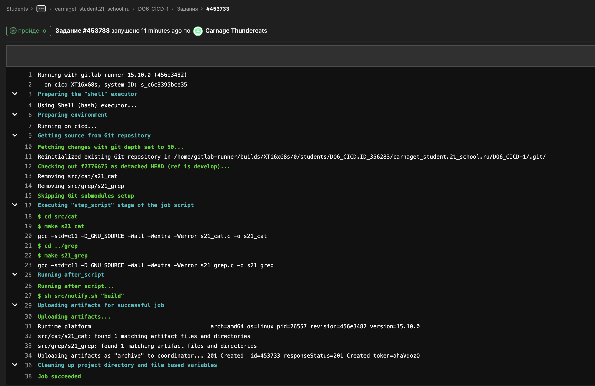
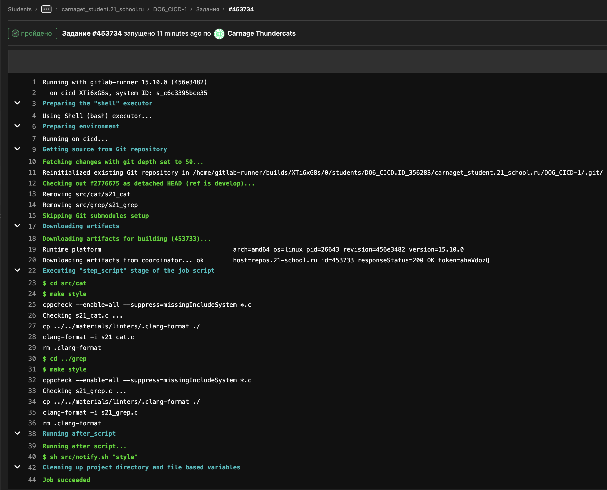
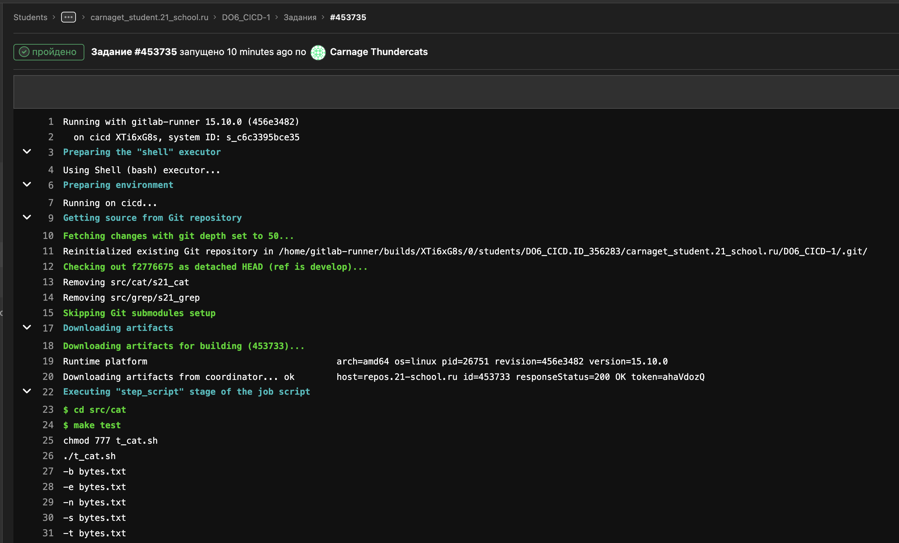
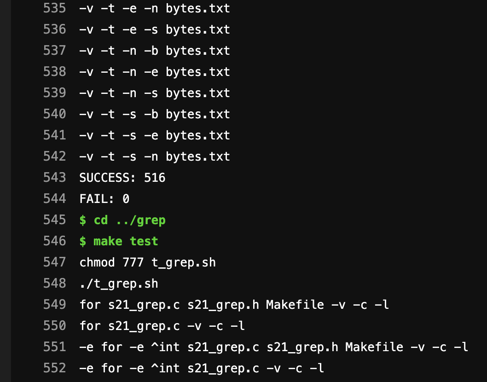
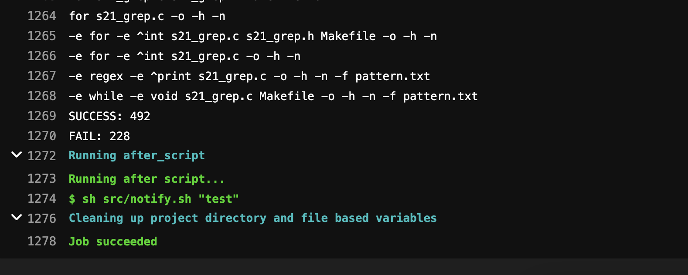
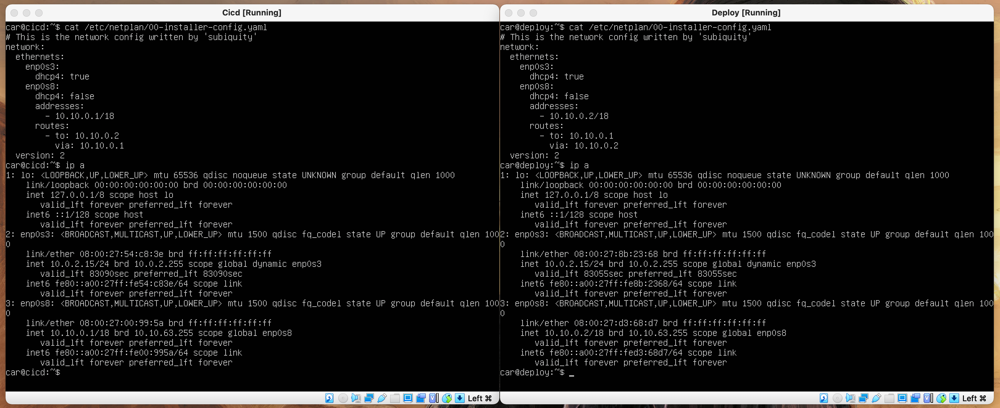
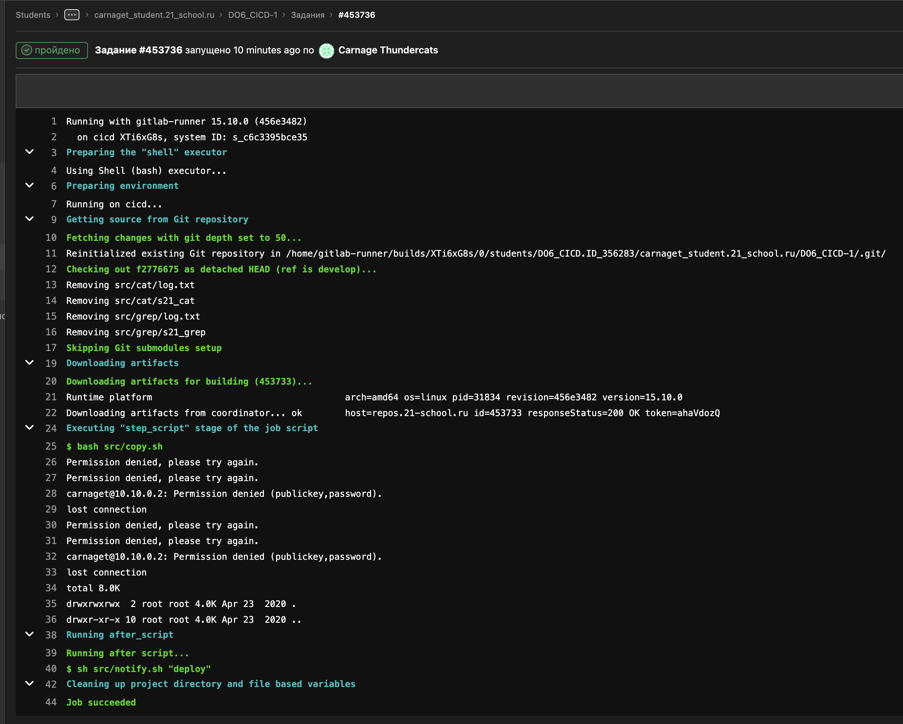
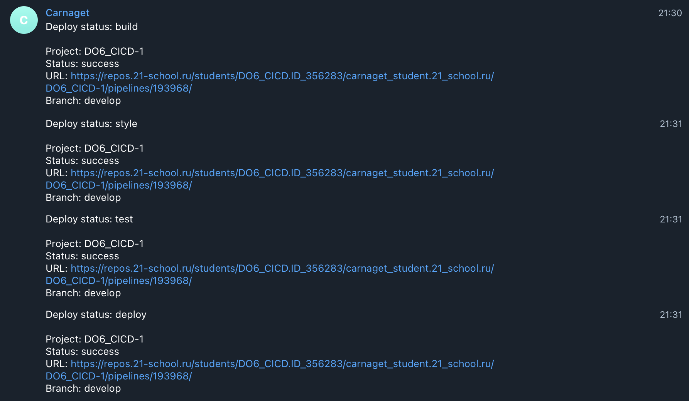

# Basic CI/CD
## Part 1. Настройка gitlab-runner

<br>

**== Выполнение ==**

<br>

  **Установка gitlab-runner** 

<br>

- 1) sudo curl -L --output /usr/local/bin/gitlab-runner "https://gitlab-runner-downloads.s3.amazonaws.com/latest/binaries/gitlab-runner-linux-amd64" </br>

- 2) sudo chmod +x /usr/local/bin/gitlab-runner </br>

- 3) sudo useradd --comment 'GitLab Runner' --create-home gitlab-runner --shell /bin/bash </br>

- 4) sudo gitlab-runner install --user=gitlab-runner --working-directory=/home/gitlab-runner </br>

- 5) sudo gitlab-runner start </br>

- 6) sudo systemctl enable --now gitlab-runner </br>

<br>

  **Регистрация gitlab-runner** 


<br>

- sudo gitlab-runner register
```
    URL: https://repos.21-school.ru
    token: <your_token_from_the_platform>
    -
    tags: build,style,test,deploy,notify
    -
    executor: shell
```
- sudo gitlab-runner verify </br>

- sudo gitlab-runner run </br>

- sudo rm /home/gitlab-runner/.bash_logout (нужно удалить его иначе работать не будет) </br>

* Проверьте статус gitlab-runner с помощью
- service gitlab-runner status

## Part 2. Сборка


**== Выполнение ==**


Создаем вне дирректории src .gitlab-ci.yml (конфиг нужно будет запушить в develop)
- nano .gitlab-ci.yml

**.gitlab-ci.yml:**
```
building:
  stage: build
  tags: 
    - build
  script:
    - cd src/cat
    - make s21_cat
    - cd ../grep
    - make s21_grep
  artifacts:
    paths:
      - src/cat/s21_cat
      - src/grep/s21_grep
    expire_in: 30 days
```

<br>*Результат выполнения команд*<br>

## Part 3. Тест кодстайла


**== Выполнение ==**

<br>

**Работаем с .gitlab-ci.yml:**


>
```
codestyle:
  stage: style
  tags: 
    - style
  script:
    - cd ${CI_PROJECT_DIR}/src
    - make style
```
<br>

<br>*Результат выполнения команд*<br>

## Part 4. Интеграционные тесты


**== Выполнение ==**


**Работаем с .gitlab-ci.yml:**
```
test_code:
  stage: test
  tags:
    - test
  script:
    - cd ${CI_PROJECT_DIR}/src
    - make test 
  when: on_success
```

**Проверим результат** 



<br>*Результат выполнения команд*<br>

## Part 5. Этап деплоя


**== Выполнение ==**


**Создайте вторую виртуальную машину для деплоя и свяжите их**

Свяжите машины

**Полезная информация:**
**На обеих машинах должен быть установлен openssh-server** 


**Для машины Cicd: Настройки > Сеть > Тип подключения "Nat" > Допольнительно > Проброс портов > Добавить новый порт > Имя "ssh", Протокол TCP, Адрес хоста " ", Порт хоста "2222", Адрес гостя " ", Порт гостя "22"**
**Так же: Добавить Адаптер > Внутренняя сеть, имя "intnet"**


**Для машины Deploy: Настройки > Сеть > Тип подключения "Nat" > Допольнительно > Проброс портов > Добавить новый порт > Имя "ssh", Протокол TCP, Адрес хоста " ", Порт хоста "9001", Адрес гостя " ", Порт гостя "22"**
**Так же: Добавить Адаптер > Внутренняя сеть, имя "intnet"**


**==netplan yaml для обоих машин:==**



написать скрипт, который копирует артефакты из сборок gitlab-runner (see src/copy.sh)

разрешить 1-й машине использовать команду ssh без пароля 2-й машины:

- 1) sudo su - gitlab-runner </br>

- 2) ssh-keygen -t rsa -b 2048 </br>

- 3) ssh-copy-id -i ~/.ssh/id_rsa.pub <username>@<ip_address> (ssh-copy-id -i ~/.ssh/id_rsa.pub car@10.10.0.2) </br>

**даем все права на папку 2-й машины куда копируем наши артефакты(прописываем во второй машине):**

- sudo chmod -R 777 /usr/local/bin/

**Работаем с .gitlab-ci.yml:**
```
deploy:
  stage: deploy
  tags:
    - deploy
  script:
    - bash src/copy.sh
  when: manual
```
<sub> manual позволяет выбрать, хотите ли вы пройти этап развертывания или нет </sub>


<br>*Результат выполнения команд*<br>

## Part 6. Дополнительно. Уведомления

**GitLab CI и Telegram**

**Создать телеграмм бота**
**Отправьте боту сообщение, чтобы настроить его для работы с пользователем (вами)**
**Сохраните необходимые значения в GitLab :**

**Настройки необходимого репозитория**

**Точка CI/CD**
**Секретные переменные**
**Сохраните токен созданного бота в переменную TELEGRAM_BOT_TOKEN**
**Сохраните идентификатор пользователя, которого нужно уведомить, в TELEGRAM_USER_ID .**


**== Выполнение ==**


**materials/notification.md (see src/notify.sh)**

**Создадим своего бота и добавим команду ($CI_JOB_STATUS) в скрипт**

**Добавим эту команду в .gitlab-ci.yml, для каждого параметра**
```
  after_script:
    - sh src/notify.sh "job_name"
```

**Проверим результат** 

- 1) Build
- 2) Style
- 3) Test
- 4) Deploy



## Полезные ссылки

* https://repos.21-school.ru/help/ci/quick_start/index.md
* https://docs.gitlab.com/runner/
* https://www.dmosk.ru/miniinstruktions.php?mini=gitlab-runner-web#runner-register
* https://repos.21-school.ru/help/ci/yaml/README
* https://docs.gitlab.com/runner/install/linux-manually.html
